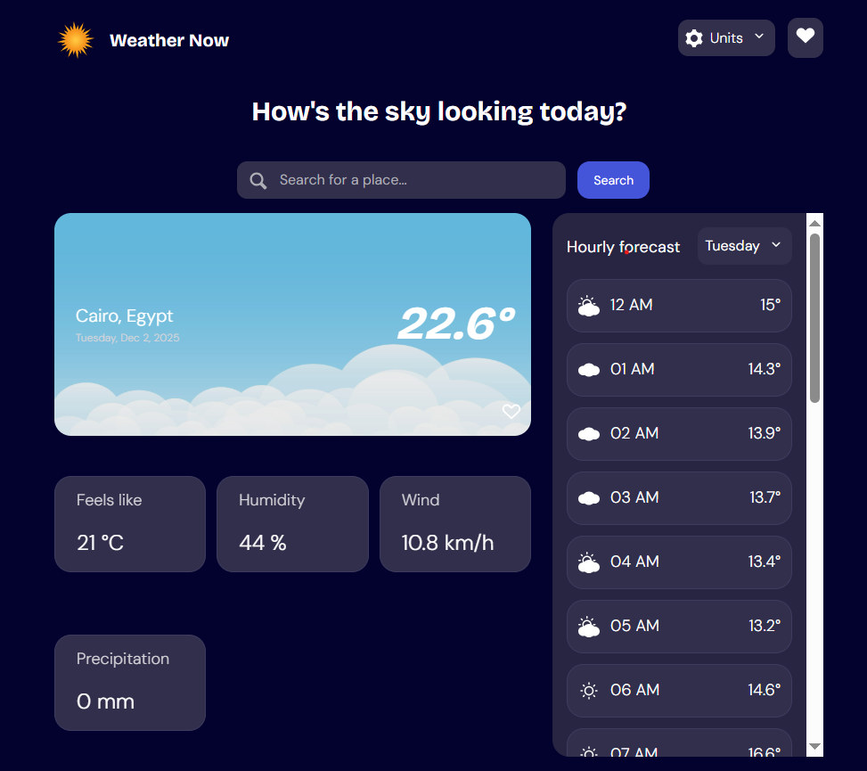

# 🌦️ Weather App

A modern, responsive weather application built using **HTML**, **Sass**, **JavaScript**, **Parcel**, and the **MVC architecture**. This project uses the **Open-Meteo API** for accurate real-time and forecast weather data.

---

## 📸 Preview

## 

## 🚀 Live Demo

🔗 **Live site:** [Weather-app](https://weather-app-mvc-project.netlify.app/)

---

## 📁 Project Overview

This weather app allows users to search for any city worldwide and view:

- Current weather conditions
- Temperature & feels-like temperature
- Humidity, wind speed, precipitation
- 7-day forecast
- Hourly forecast with day switcher
- Favorite locations saved locally
- Automatic weather detection using device geolocation

The app is built following the **MVC architecture** to keep the code clean, modular, and scalable.

---

## ✨ Features

### 🔍 Search

- Search for any location via the Open-Meteo Geocoding API

### 📍 Current Weather

- Temperature (°C / °F)
- Weather icon + description
- Location details
- Additional metrics: humidity, wind speed, precipitation

### 📅 Forecast

- **7-day forecast** with daily high/low
- **Hourly forecast** with day selector
- Smooth UI for browsing weather changes throughout the day

### ⚙️ Units

- Temperature: °C / °F
- Wind: km/h / mph
- Rain: mm / inches

### ⭐ Favorites System

- Save & remove favorite locations
- Stored in `localStorage`

### 📍 Geolocation

- Automatically shows weather for user’s current location on first visit

### 📱 Responsive Design

- Optimized layout for mobile, tablet, and desktop

---

## 🧱 Tech Stack

- **HTML5** (semantic structure)
- **Sass (SCSS)** for styling
- **JavaScript ES6+**
- **Parcel Bundler**
- **MVC architecture**
- **Open-Meteo API**

---

---

## 🔧 Installation & Setup

### 1️⃣ Clone the Repo

```bash
git clone https://github.com/MarimReda25/weather-app.git
cd weather-app
```

### 2️⃣ Install Dependencies

```bash
npm install
```

### 3️⃣ Start Development Server

```bash
npm run start
```

Parcel will automatically open `http://localhost:1234/`.

### 4️⃣ Build for Production

```bash
npm run build
```

The optimized project will be generated in `/dist`.

---

## 🌤️ Working with the Open-Meteo API

### ▶️ Geocoding API

Used to convert user search input into latitude/longitude.

### ▶️ Forecast API

Used to fetch:

- Current weather
- Hourly temperature
- 7-day forecast
- Humidity, precipitation, wind, weather codes

---

## 🧠 MVC Architecture

### **Model**

- Fetches API data
- Saves favorites in `localStorage`
- Stores unit preferences

### **View**

- Renders UI components
- Handles user interactions (search, toggles, favorites)

### **Controller**

- Connects Model and Views
- Handles app logic

---

## 🧪 Future Improvements

- Dark mode
- Offline caching using Service Worker
- Animated hourly temperature chart
- Multi-language support

---
